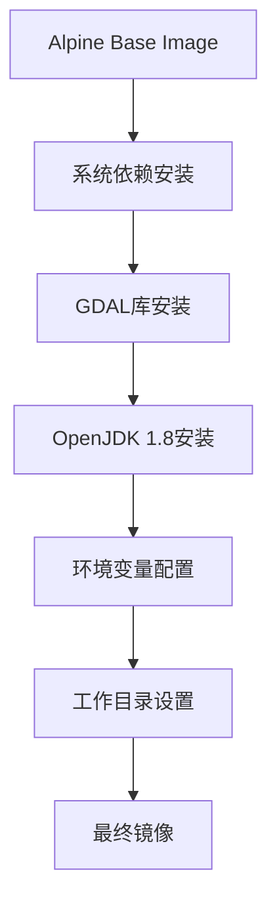
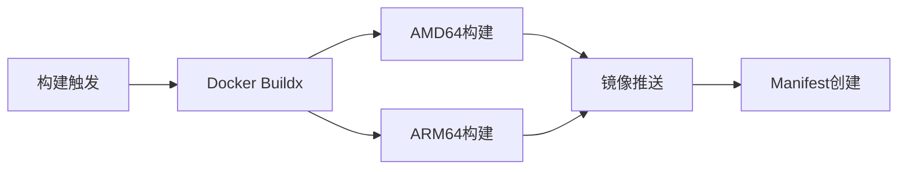
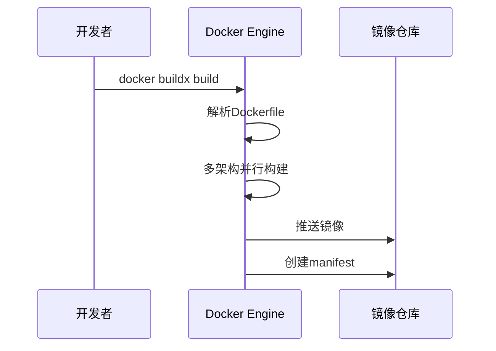
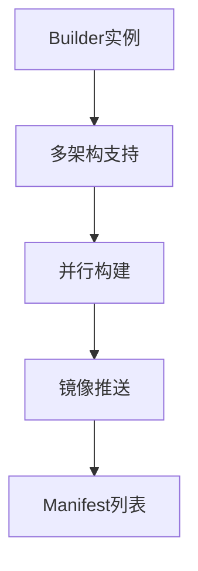
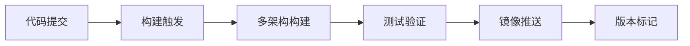

# 多架构GDAL镜像构建设计

## 概述

本设计文档描述了如何基于Alpine基础镜像构建支持多架构（AMD64、ARM64）的GDAL（Geospatial Data Abstraction Library）Docker镜像，集成JDK 1.8运行环境。该镜像将提供完整的地理空间数据处理能力和Java运行环境支持。

## 技术栈

- **基础镜像**: Alpine Linux（轻量级Linux发行版）
- **GDAL版本**: 最新稳定版本（通过Alpine包管理器安装）
- **Java运行环境**: OpenJDK 1.8
- **支持架构**: 
  - linux/amd64（x86_64）
  - linux/arm64（aarch64）

## 架构设计

### 镜像层次结构



### 多架构构建策略



## 目录结构设计

```
dockerfile/
├── gdal/
│   ├── Dockerfile
│   ├── docker-compose.yml
│   ├── build.sh
│   └── README.md
└── README.md
```

## 镜像构建设计

### Dockerfile设计要点

1. **多阶段构建优化**
   - 使用Alpine基础镜像减少镜像大小
   - 清理不必要的构建依赖

2. **包管理策略**
   - 使用Alpine的apk包管理器
   - 组合安装命令减少镜像层数
   - 及时清理缓存

3. **环境配置**
   - GDAL数据路径配置
   - Java环境变量设置
   - 工作目录标准化

### 核心构建流程



## 运行时环境配置

### 环境变量设计

| 变量名 | 默认值 | 描述 |
|--------|--------|------|
| GDAL_DATA | /usr/share/gdal | GDAL数据文件路径 |
| JAVA_HOME | /usr/lib/jvm/java-1.8-openjdk | Java安装路径 |
| PATH | $PATH:$JAVA_HOME/bin | 可执行文件路径 |

### 卷挂载设计

| 挂载点 | 用途 | 权限 |
|--------|------|------|
| /data | 数据输入输出目录 | rw |
| /workspace | 工作空间 | rw |

## 构建工具集成

### Docker Buildx配置



### 构建脚本设计

构建脚本将包含以下功能：
- 自动化多架构构建
- 镜像标签管理
- 构建日志记录
- 错误处理机制

## 安全考虑

### 镜像安全

1. **最小权限原则**
   - 使用非root用户运行
   - 限制文件系统权限

2. **依赖安全**
   - 定期更新基础镜像
   - 扫描已知漏洞

### 运行时安全

1. **网络隔离**
   - 最小化网络暴露
   - 使用安全的网络配置

2. **资源限制**
   - CPU和内存限制
   - 磁盘空间控制

## 性能优化

### 镜像大小优化

1. **层合并策略**
   - 合并相关的RUN命令
   - 及时清理临时文件

2. **缓存优化**
   - 合理排序Dockerfile指令
   - 利用Docker层缓存

### 运行时性能

1. **资源配置**
   - 合理的内存分配
   - CPU核心数配置

2. **并行处理**
   - GDAL多线程支持
   - JVM并行垃圾回收

## 测试策略

### 功能测试


### 测试用例设计

1. **GDAL功能验证**
   - gdalinfo命令测试
   - 格式转换测试
   - 投影变换测试

2. **Java环境验证**
   - Java版本检查
   - 类路径配置验证
   - 内存分配测试

3. **多架构验证**
   - AMD64平台测试
   - ARM64平台测试
   - 交叉兼容性验证

## 部署与使用

### 镜像拉取

用户可通过以下方式获取镜像：
```bash
docker pull [registry]/gdal:latest
```

### 容器运行

标准运行模式：
```bash
docker run -it --rm \
  -v $(pwd)/data:/data \
  [registry]/gdal:latest
```

### CI/CD集成



## 维护与更新

### 版本管理

1. **语义化版本控制**
   - 主版本：重大变更
   - 次版本：功能添加
   - 补丁版本：Bug修复

2. **标签策略**
   - latest：最新稳定版
   - vX.Y.Z：具体版本
   - alpine：基于Alpine的版本

### 更新策略

1. **定期更新**
   - 基础镜像更新
   - 安全补丁应用
   - GDAL版本升级

2. **兼容性维护**
   - 向后兼容性保证
   - 迁移指南提供
   - 废弃功能通知

## 监控与日志

### 构建监控

1. **构建状态跟踪**
   - 构建成功率统计
   - 构建时间监控
   - 错误率分析

2. **镜像大小监控**
   - 大小趋势分析
   - 层数量统计
   - 优化效果评估

### 使用日志

1. **运行时日志**
   - 容器启动日志
   - GDAL操作日志
   - 错误日志收集

2. **性能指标**
   - 资源使用率
   - 处理速度统计
   - 内存使用分析